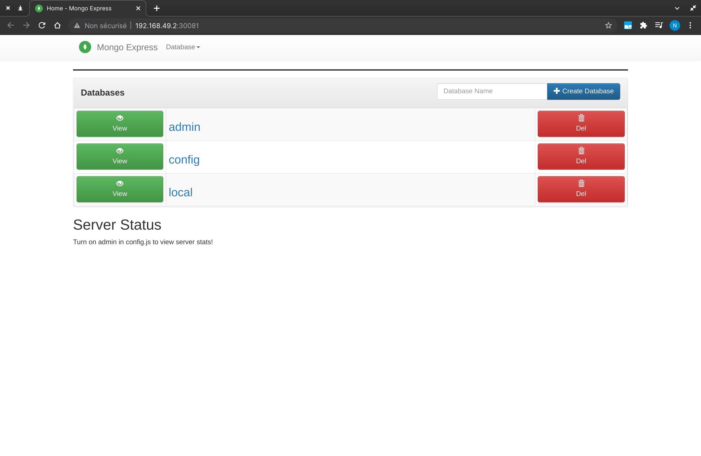

# MongoDB & MongoExpress on Minikube

Follow these steps to build MongoDB and MongoExpress on Kubernetes. (for each command, I wrote the output so you can see if everything goes well)

## Prerequisites
- Docker
- Minikube
- kubectl


## Steps
### MongoDB secret:
The secrets (mongoDB username and password) are encoded in base64. You can change them by running:
```sh
$ echo -n 'username' | base64
dXNlcm5hbWU=

$ echo -n 'password' | base64
cGFzc3dvcmQ=
```
and putting the outputs in the mongo-secret.yaml file.

Then, apply the secret file:

```sh
$ kubectl apply -f mongo-secret.yaml
secret/mongo-secret created

$ kubectl get secret
NAME                  TYPE                                  DATA   AGE
default-token-zm97b   kubernetes.io/service-account-token   3      15m
mongo-secret          Opaque                                2      7m45s
```

### MongoDB deployment
```sh
$ kubectl apply -f mongodb.yaml
deployment.apps/mongodb-dep created

$ kubectl get pods
NAME                          READY   STATUS              RESTARTS   AGE
mongodb-dep-7d9dcd7fc-2n74p   1/1     Running             0          25s
```

### MongoDB internal service
```sh
$ kubectl apply -f mongodb-service.yaml
service/mongodb-service created
```

### Mongo config
```sh
$ kubectl apply -f mongo-config.yaml
configmap/mongo-config created
```

### MongoExpress deployment
```sh
$ kubectl apply -f mongo-express.yaml
deployment.apps/mongo-express created

$ kubectl get pods
NAME                             READY   STATUS    RESTARTS   AGE
mongo-express-777b9977cf-b9cpd   1/1     Running   0          17s
mongodb-dep-7d9dcd7fc-2n74p      1/1     Running   0          106s
```

### MongoExpress external service
```sh
$ kubectl apply -f mongo-express-external.yaml
service/mongo-express-service created
```

You can see all the services like this:
```sh
$ kubectl get service
NAME                    TYPE           CLUSTER-IP      EXTERNAL-IP   PORT(S)          AGE
kubernetes              ClusterIP      10.96.0.1       <none>        443/TCP          5m59s
mongo-express-service   LoadBalancer   10.99.144.23    <pending>     8081:30081/TCP   17s
mongodb-service         ClusterIP      10.110.132.66   <none>        27017/TCP        94s
```


Finally, to access MongoExpress in your browser, run:
```sh
$ minikube service mongo-express-service
|-----------|-----------------------|-------------|---------------------------|
| NAMESPACE |         NAME          | TARGET PORT |            URL            |
|-----------|-----------------------|-------------|---------------------------|
| default   | mongo-express-service |        8081 | http://192.168.49.2:30081 |
|-----------|-----------------------|-------------|---------------------------|
🎉  Opening service default/mongo-express-service in default browser...
```


Now your browser is open and you can see the following web page:



## 